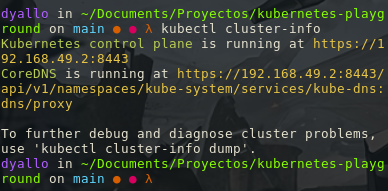
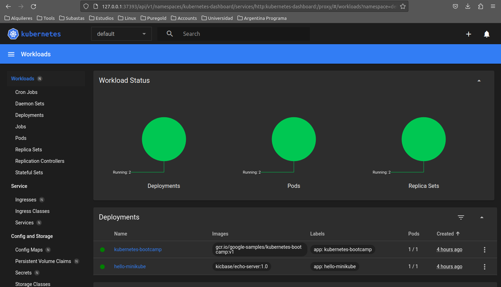
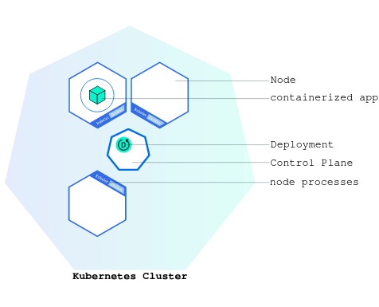
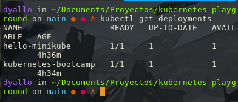

# kubernetes-playground

## Requirements 🧰

- [Kubectl](https://kubernetes.io/docs/tasks/tools/#kubectl) 
- [Minikube](https://minikube.sigs.k8s.io/docs/start/)

## Create a cluster


Important points

- The Control Plane is responsible for managing the cluster.
- A node is a VM or a physical computer that serves as a worker machine in a Kubernetes cluster.
- Node-level components, such as the kubelet, communicate with the control plane using the Kubernetes API

### Start minikube

```bash
minikube start
```

### Check cluster status

```bash
kubectl cluster-info
```



### Start the dashboard

```bash
minikube dashboard
```



Other services and commands related to minikube can be found [here](https://minikube.sigs.k8s.io/docs/start/)

## Using kubectl to create a Deployment

### Objectives

- Learn about application Deployments.
- Deploy your first app on Kubernetes with kubectl.



- You can create deployments using `kubectl` which communicates with kubernetes API.

#### kubectl basics

The common format of a kubectl command is: `kubectl action resource`

To deploy an app we can use the following command:

```bash
kubectl create deployment kubernetes-bootcamp --image=gcr.io/google-samples/kubernetes-bootcamp:v1
```

To list the deployments:

```bash
kubectl get deployments
```

