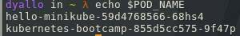
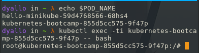

# kubernetes-playground

## Requirements 🧰

- [Kubectl](https://kubernetes.io/docs/tasks/tools/#kubectl) 
- [Minikube](https://minikube.sigs.k8s.io/docs/start/)

## Create a cluster


Important points

- The Control Plane is responsible for managing the cluster.
- A node is a VM or a physical computer that serves as a worker machine in a Kubernetes cluster.
- Node-level components, such as the kubelet, communicate with the control plane using the Kubernetes API

### Start minikube

```bash
minikube start
```

### Check cluster status

```bash
kubectl cluster-info
```


### Start the dashboard

```bash
minikube dashboard
```


Other services and commands related to minikube can be found [here](https://minikube.sigs.k8s.io/docs/start/)

## Using kubectl to create a Deployment

### Objectives

- Learn about application Deployments.
- Deploy your first app on Kubernetes with kubectl.


- You can create deployments using `kubectl` which communicates with kubernetes API.

#### kubectl basics

The common format of a kubectl command is: `kubectl action resource`

To deploy an app we can use the following command:

```bash
kubectl create deployment kubernetes-bootcamp --image=gcr.io/google-samples/kubernetes-bootcamp:v1
```

To list the deployments:

```bash
kubectl get deployments
```


## Viewing Pods and Nodes

#### Objectives

- Learn about Kubernetes Pods.
- Learn about Kubernetes Nodes.
- Troubleshoot deployed applications.

#### Pod

A Pod is a Kubernetes abstraction that represents a group of one or more application containers (such as Docker).

For example, a Pod might include both the container with your Node.js app as well as a different container that feeds the data to be published by the Node.js webserver.


#### Nodes

A Pod always runs on a Node. A Node is a worker machine in Kubernetes and may be either a virtual or a physical machine, depending on the cluster.

Every Kubernetes Node runs at least:

- Kubelet, a process responsible for communication between the Kubernetes control plane and the Node; it manages the Pods and the containers running on a machine.

- A container runtime (like Docker) responsible for pulling the container image from a registry, unpacking the container, and running the application.


We can have the name of the pods like this:

```bash
export POD_NAME=$(kubectl get pods -o go-template --template '{{range .items}}{{.metadata.name}}{{"\n"}}{{end}}')
```



If we want to see the logs of the pod we can use the following command:

```bash
kubectl logs $POD_NAME
```

To execute a command on the container we can use the following command:

```bash
kubectl exec "$POD_NAME" -- env
```

To enter with a interactive shell we can use the following command:

```bash
kubectl exec -ti $POD_NAME -- bash
```



Now we can check inside the node the server is running on port 8080

```bash
cat server.js
curl localhost:8080
```

