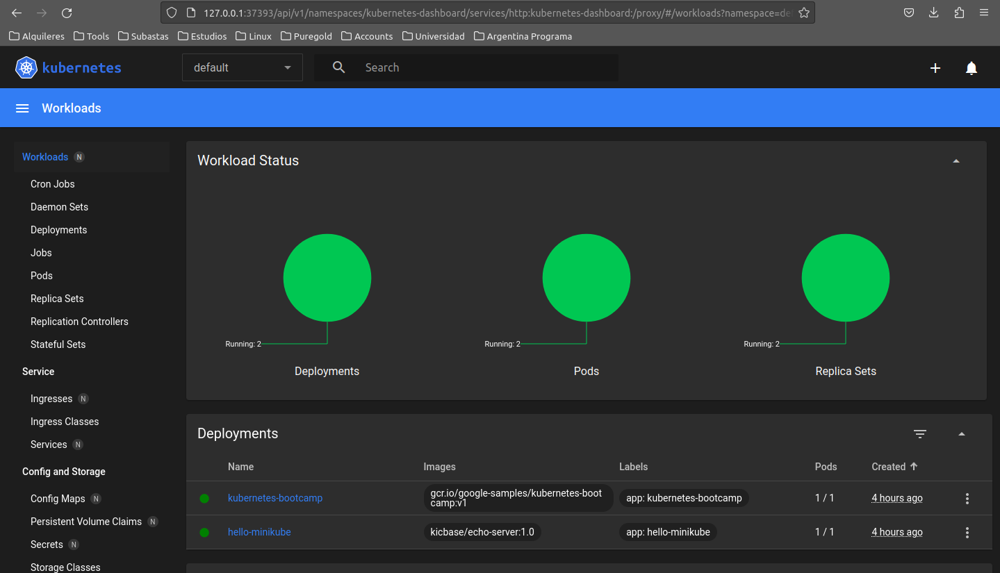

## Create a cluster


Important points

- The Control Plane is responsible for managing the cluster.
- A node is a VM or a physical computer that serves as a worker machine in a Kubernetes cluster.
- Node-level components, such as the kubelet, communicate with the control plane using the Kubernetes API

### Start minikube

```bash
minikube start
```

### Check cluster status

```bash
kubectl cluster-info
```


### Start the dashboard

```bash
minikube dashboard
```



Other services and commands related to minikube can be found [here](https://minikube.sigs.k8s.io/docs/start/)