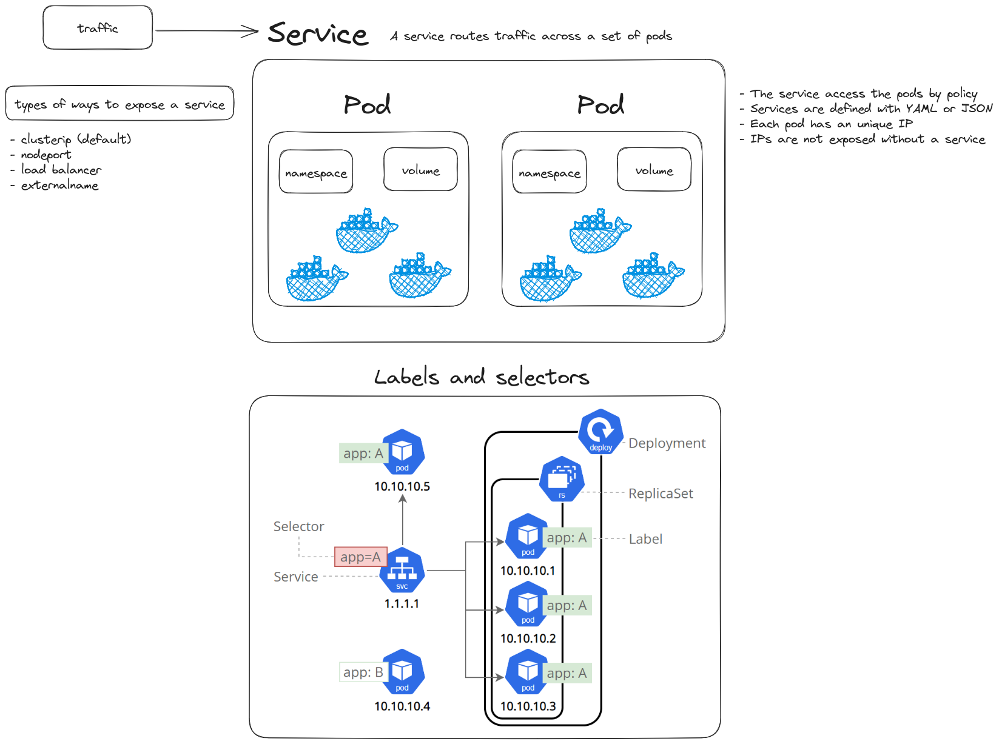
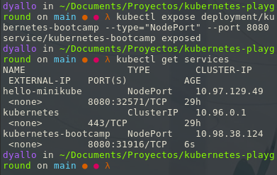
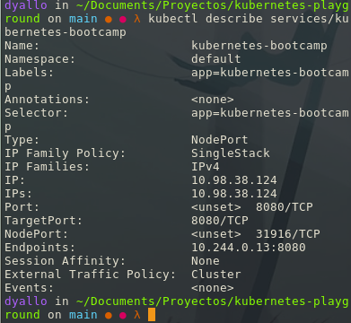
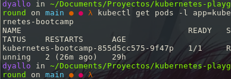
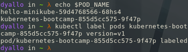
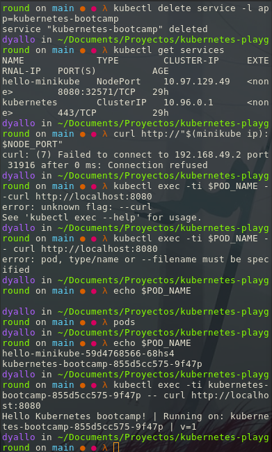

## Using a service to expose your app

### Objectives

- Learn about a Service in Kubernetes
- Understand how labels and selectors relate to a Service
- Expose an application outside a Kubernetes cluster using a Service

General idea about services



To list the current services that we have:

```bash
kubectl get services
```

We have a Service called kubernetes that is created by default when minikube starts the cluster. To create a new service and expose it to external traffic we'll use the expose command with NodePort as parameter.

`kubectl expose deployment/kubernetes-bootcamp --type="NodePort" --port 8080`



To describe the service we created before:

```bash
kubectl describe services/kubernetes-bootcamp
```



To get the node port:

```bash
export NODE_PORT="$(kubectl get services/kubernetes-bootcamp -o go-template='{{(index .spec.ports 0).nodePort}}')"
```

Now we can test that the app is exposed outside of the cluster using curl, the IP address of the Node and the externally exposed port:

```bash
curl http://"$(minikube ip):$NODE_PORT"
```

And we get a response from the server. The Service is exposed.

#### Step 2: Using labels

To see the default labels for the pod we created before:

```bash
kubectl describe deployment
```

And we look for the labels section in my case is:

```bash
Labels:             app=kubernetes-bootcamp
```

Now let's get the list of pods using the label selector:

```bash
kubectl get pods -l app=kubernetes-bootcamp
```



You can do the same to list the existing Services:

```bash
kubectl get services -l app=kubernetes-bootcamp
```

We can label a pod with the command:

```bash
kubectl label pods $POD_NAME app=v1
```



Now if we do:

```bash
kubectl get pods -l version=v1
```

We get the pod we just labeled.

#### Deleting a service

To delete a service we use the delete command:

```bash
kubectl delete service -l app=kubernetes-bootcamp
```

Confirm that the service is gone:

```bash
kubectl get services
```

Lets enter the pod and see if we can access the app:

```bash
kubectl exec -ti $POD_NAME -- curl http://localhost:8080
```

Here we can see that the app is not longer accessible from outside the cluster. But we can still access it from inside the cluster.

