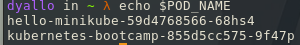
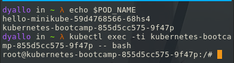

## Viewing Pods and Nodes

#### Objectives

- Learn about Kubernetes Pods.
- Learn about Kubernetes Nodes.
- Troubleshoot deployed applications.

#### Pod

A Pod is a Kubernetes abstraction that represents a group of one or more application containers (such as Docker).

For example, a Pod might include both the container with your Node.js app as well as a different container that feeds the data to be published by the Node.js webserver.


#### Nodes

A Pod always runs on a Node. A Node is a worker machine in Kubernetes and may be either a virtual or a physical machine, depending on the cluster.

Every Kubernetes Node runs at least:

- Kubelet, a process responsible for communication between the Kubernetes control plane and the Node; it manages the Pods and the containers running on a machine.

- A container runtime (like Docker) responsible for pulling the container image from a registry, unpacking the container, and running the application.


We can have the name of the pods like this:

```bash
export POD_NAME=$(kubectl get pods -o go-template --template '{{range .items}}{{.metadata.name}}{{"\n"}}{{end}}')
```



If we want to see the logs of the pod we can use the following command:

```bash
kubectl logs $POD_NAME
```

To execute a command on the container we can use the following command:

```bash
kubectl exec "$POD_NAME" -- env
```

To enter with a interactive shell we can use the following command:

```bash
kubectl exec -ti $POD_NAME -- bash
```



Now we can check inside the node the server is running on port 8080

```bash
cat server.js
curl localhost:8080
```

