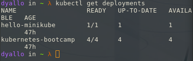
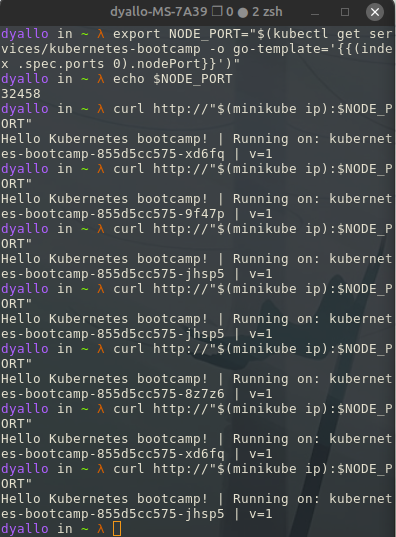

## Running Multiple Instances of Your App

#### Objectives

- Scale an app using kubectl.

#### Scaling an application

At this we should already have a deployment running and we should be able to access it using the service we created before.

If now you can create a deployment using the following command:

```bash
kubectl create deployment kubernetes-bootcamp --image=gcr.io/google-samples/kubernetes-bootcamp:v1
```

Now we can check the status of the deployment using the following command:

```bash
kubectl get deployments
```

#### Scaling overview

- [scaling](https://kubernetes.io/docs/tutorials/kubernetes-basics/scale/scale-intro/)


Scaling will create more pods and will distribute the traffic between them. This is to ensure that the app is always available.

To scale up to 4 replicas for the deployment, run the following command:

```bash
kubectl scale deployments/kubernetes-bootcamp --replicas=4
```

(to scale down is the same command but with less replicas)

Now if we check the status of the deployment we should see that we have 4 replicas running:

```bash
kubectl get deployments
```



Now we can check the deployment (make sure to have your service exposed):

```bash
kubectl describe deployments/kubernetes-bootcamp
```


#### Load Balancing

Having the node port we can do a curl and check the response from the server:

```bash
curl $(minikube ip):$NODE_PORT
```

